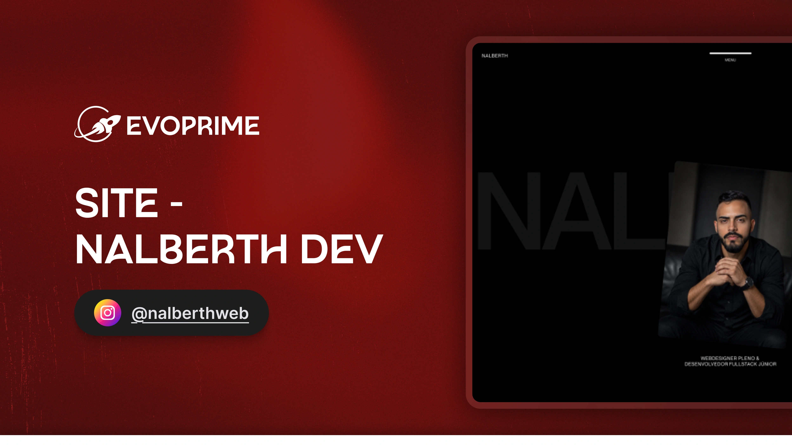

# Nalberth Dev — Portfólio

[Tecnologias](#-tecnologias) | [Projeto](#-projeto) | [Layout](#-layout) | [Estrutura do projeto](#-estrutura-do-projeto) | [Licença](#-licença)



## 🚀 Tecnologias

Esse projeto foi desenvolvido com as seguintes tecnologias:

- [Next.js](https://nextjs.org/) 14 (Pages Router) + [TypeScript](https://www.typescriptlang.org/)
- [Sass](https://sass-lang.com/) (CSS Modules)
- [GSAP](https://gsap.com/) + ScrollTrigger — animações e efeitos de scroll
- [Framer Motion](https://www.framer.com/motion/)
- [Lenis](https://github.com/studio-freight/lenis) — smooth scrolling
- [React Icons](https://react-icons.github.io/react-icons/)
- [ESLint](https://eslint.org/)

## 💻 Projeto

Site de portfólio pessoal de **Nalberth**, webdesigner e desenvolvedor full stack júnior. A página apresenta a atuação profissional, os serviços prestados e os principais projetos, com foco em animações fluidas e transições de scroll.

A landing page é dividida em seções:

- **Hero** — apresentação com marquee animado
- **Sobre** — resumo da trajetória profissional
- **Capacidades** — cards de serviços (Design, Estratégia, Desenvolvimento, E-commerce)
- **Criações** — galeria de projetos recentes com links para o Behance
- **Prêmios** e **Dribbble** — reconhecimentos e referências
- **Contato** — chamada para conversa via WhatsApp

### Como executar

Clone o repositório e instale as dependências:

```bash
npm install
```

Rode o servidor de desenvolvimento:

```bash
npm run dev
```

Acesse [http://localhost:3000](http://localhost:3000).

Outros scripts disponíveis:

```bash
npm run build   # build de produção
npm run start   # inicia o build de produção
npm run lint    # roda o linter
```

## 🎨 Layout

O layout segue uma estética editorial e dinâmica, com tipografia em destaque, transições suaves entre seções e microinterações guiadas por scroll.

Principais características:

- Componentização por seção, com estilos isolados via CSS Modules (`.module.scss`)
- Animações de entrada, marquee e flip cards controladas com GSAP/ScrollTrigger
- Scroll suave em toda a aplicação com Lenis
- Navegação por âncoras (`/#inicio`, `/#sobre`, `/#projetos`, `/#contato`)

## 📁 Estrutura do projeto

```
nalberth-site/
├── components/
│   ├── Button/
│   ├── Footer/
│   ├── HomePage/
│   │   ├── AboutSection/
│   │   ├── AwardSection/
│   │   ├── BookCallSection/
│   │   ├── DribbleSection/
│   │   ├── HeroSection/
│   │   ├── ImageTrail/
│   │   ├── ProjectSection/
│   │   └── ServiceSection/
│   ├── Loader/
│   ├── Nav/
│   ├── SmoothScrolling/
│   └── Tag/
├── libs/
│   └── gsap/
├── pages/
│   ├── _app.tsx
│   ├── _document.tsx
│   └── index.tsx
├── public/
│   └── images/
├── styles/
│   ├── globals.scss
│   └── variables.scss
├── utils/
│   └── textUtils.tsx
└── README.md
```

## 📝 Licença

Este projeto está sob a licença MIT.

---

Feito com ❤️ por **Nalberth Dev**
